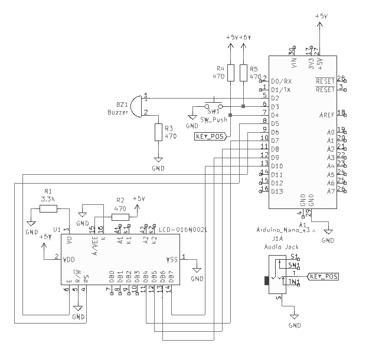

# CWDecoder

CWDecoder is a realtime _morsecode-to-ascii_ translator
for ATMega µC written in C.

<div align="center">
    
</div>


## Building
PCB layout has been tested and it's ensured that it works, if you wanna buy a copy of 
this decoder, compress _gerbers_ directory(`pcb/gerbers`) in a `zip` file and build it
from your favourite PCB manufacturing company(may i suggest you [JLCPCB](https://jlcpcb.com/)?).  
**NOTE**: PCB manufacturing companies will sell you just the circuit boards, **WITHOUT** any components on it, so you still need to buy elsewhere [components](#component-list) and solder them manually.

The code provided in this repository is adapted to the schematics, but it can be changed (for instance pin number of I/O devices) according to your needs.

### Schematics
KiCAD `.pro` project file can be found into `pcb` directory.  

<div align="center">
    
    
</div>

### Component list
To build this project you will need the following components:  
- x4 470Ohm resistor;  
- x1 3.3kOhm resistor;  
- x1 3.5mm AudioJack connector;  
- x1 LCD1602 liquid crystal display;  
- x1 Arduino nano;
- x1 buzzer(maximum size: 12.2x6.5mm)  
- x1 push button


### Software
**NOTE:** In order to build it you will need the 
[Arduino SDK](https://www.arduino.cc/en/main/software) and the [LiquidCrystal Library](https://www.arduino.cc/en/Reference/LiquidCrystal).  
CWDecoder works in a very simple way, it constantly check if _button state_ has changed:
```c
    ...
    key.currentState = digitalRead(key.pin); // Retrieve key status
    if(key.currentState != key.prevState) {
        if(key.currentState == HIGH) { // If button state is HIGH
            // Start to beep and power on LED
            ...
            key.counter = millis(); // Record when button has been pressed
        } else if(key.currentState == LOW) {
            // If button has been released, then determines if it is a 'dit' or 'dat'.
        }
    }
```
 if so it determines whether the input is of _long_(ie a 'dah') or _short_ type(ie a 'dit'); to do so, when the button is released, it checks if _active time_(ie time when straight key is pressed)
 is greater than two constant fixed time(`shortPress` and `longPress`):
 ```c
    ...
    uint64_t currentTime = millis(); // Get current time
    // If button has been pressed enough time for a dit...
    if(((currentTime - key.counter) >= shortPress) && (currentTime - key.counter))
        buttonEvent(0); // ...Handle a dit
    else if((currentTime - key.counter) >= longPress) // Otherwise
        buttonEvent(1); // Handle a dat
    ...
 ```
At this point it calls `buttonEvent()` function, which add the proper symbol(ie a dot or a line) to a fixed size char buffer:
```c
    void buttonEvent(uint8_t type_of_event) {
        if(type_of_event == 0) // Short press
            buf[++pos] = '.';
        else if(type_of_event == 1) // Long press
        buf[++pos] = '-';
    }
```

Last but not least, after last function has returned, it sample the buffer if and only a certain amount of time
has passed. Without this mechanism, for instance, the program would not distinguish
between the letter 'e'(a single `dit` in morse code) and the letter 's'(three `dit` in morse code):
```c
    const short wpm = 500; // Words-per-minute 
     // If user hasn't touched key for enough time, then we can sample the buffer
    if((millis() - timeLast) > wpm)
        translate();
```
**NOTE**: words-per-minute value is **NOT** accurate, i found out that `500` is something like `~24wpm`.  
`translate()` function does the following:
```c
    char translatedWord = converter(buf); // Convert what's inside the buffer
    ...
    lcd.print(translatedWord); // Print ASCII character into the LCD.
```
After each letter has been translated, it empty the buffer to prevent buffer overflow.
In this way it's possible to use a tiny char buffer and save a lot of precious memory:
```c
    memset(buf, 0, sizeof(buf)); // reset buffer
    pos = -1; // Set index at the beginning
```

### Character support
By default CWDecoder support international alphabet(ie English alphabet) + 0-9 numbers. If you need special characters
(such as comma, period, blockquote, etc.) you can add them by adding new entry on `converter()` function:
```c
    ...
     else if(!strcmp(ch, "<morse_code>")) { return '<ascii_letter>'; }
    ...
```

## License
This project is been released under 
[GPLv3](https://choosealicense.com/licenses/gpl-3.0/) license.
